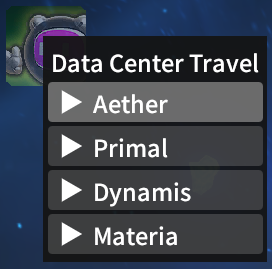
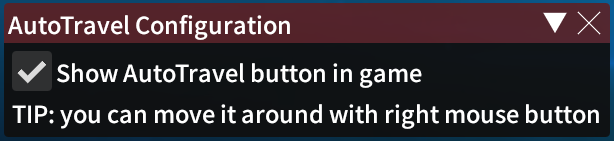

#  AutoTravel

Travel between datacenters with single click

## Installation

See: https://github.com/anomek/MyDalamudPlugins

## Details

* Start travel from character login screen or from within game
* Select just data center you want to travel to, or specifc world
* If world is unavailable, other random available one will be picked
* If no worlds are available, it will keep retring (needs to be enabled in configuration)

## Acknowledgments

* inspired by https://github.com/PunishXIV/YesAlready
* some code copied from https://github.com/NightmareXIV/ECommons

